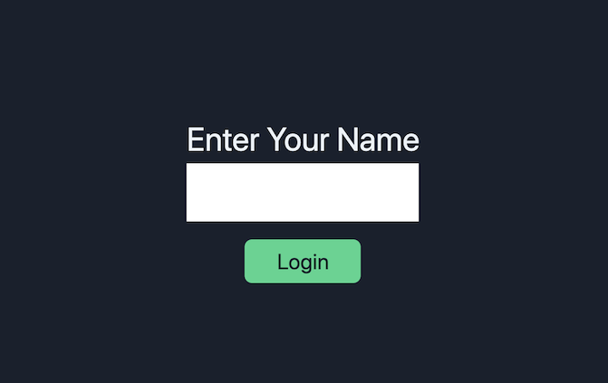
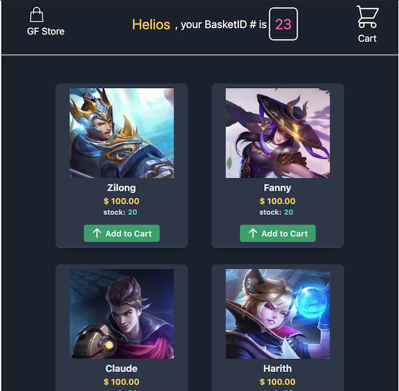
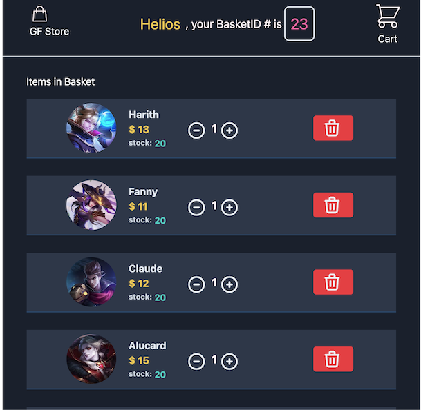
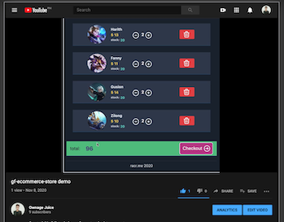

# gf-ecommerce-store 
### This is a demo of a Java Spring Boot + SvelteJS fullstack e-commerce store with added mobile responsive layout




### Video Demo
[](https://www.youtube.com/watch?v=gKTPasRWe2g&ab_channel=OwnageJuice)      

### Try the gf-ecommerce-store online via this link:

Backend server is not dedicated yet, might turn it on or off. You can email me at reyanthonyrenacia@gmail.com so I can spin-up an 'ngrok' https instance for you. Or, you could just clone this repo and run it all in your machine.
A full-fledge version would have the Spring Boot + MyBatis + SQL backend running on the cloud like Heroku or GCP
instead of localhost.

Check:

        gf-ecommerce-store/tree/master/gf-ecommerce-backend
in this repo for the Java Spring Boot backend code.
### Powered by these Techstack:
#### Front-end
- [SvelteJS](https://github.com/sveltejs/template)
- [RoutifyJS](https://routify.dev/guide/installation/install-to-existing-project)
- [TailwindCSS](https://dev.to/inalbant/a-simpler-way-to-add-tailwindcss-to-your-svelte-project-11ja)
#### Back-end
- [MySQL](https://www.mysql.com/)
- [MyBatis](https://blog.mybatis.org/)
- [Spring Boot](https://docs.spring.io/spring-boot/docs/current/reference/htmlsingle)

### List of existing URI endpoints:
All REST API endpoints can be found in the ShoppingRestController.java class of this repo:

    - Create a new basket
       ```POST localhost:8085/newBasket```
        
    - Fetch all your items inside your basket
        ```GET localhost:8085/fetchAllItemObjects/{basketId}```
        
    - Add a new item inside your basket
        ```POST localhost:8085/newItem```
        
    - Delete an item form you basket
         ```DELETE localhost:8085/deleteItem/{basketId}/{itemID}```
         
    - Fetch current/last user
        ```GET localhost:8085/getLastUser```
        
### How to run this repo on your local machine
##### Start Front-end
1. Git clone:
        ```https://github.com/heliosnarcissus/gf-ecommerce-store.git```
    
2. CD inside folder and Install NPM:
        ```npm install'''
        
3. executue ```npm run dev```
##### Start Back-end
    1. Import as Maven Project

    2. Enter your MySQL username and password as well as specify your schema name in application.properties:
        ```gf-ecommerce-backend/src/main/resources/application.properties```
    
    3. Run as Spring Boot application in BackendStartMain.java
          
#### Work In Progress:
 I will be adding a payment API like Paypal or Stripe soon.

